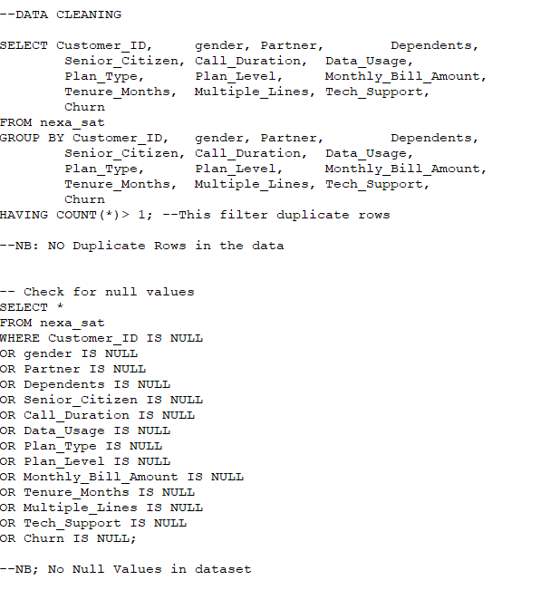
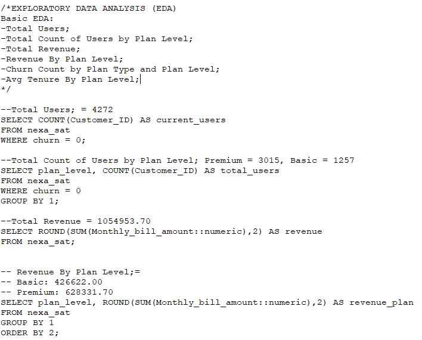
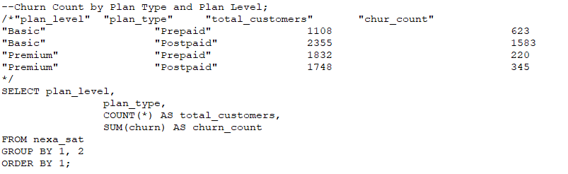
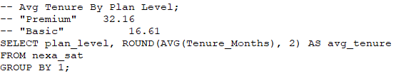
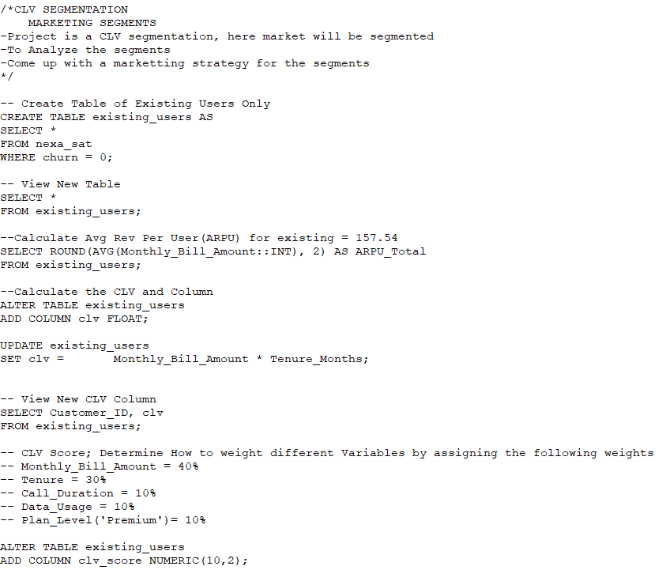
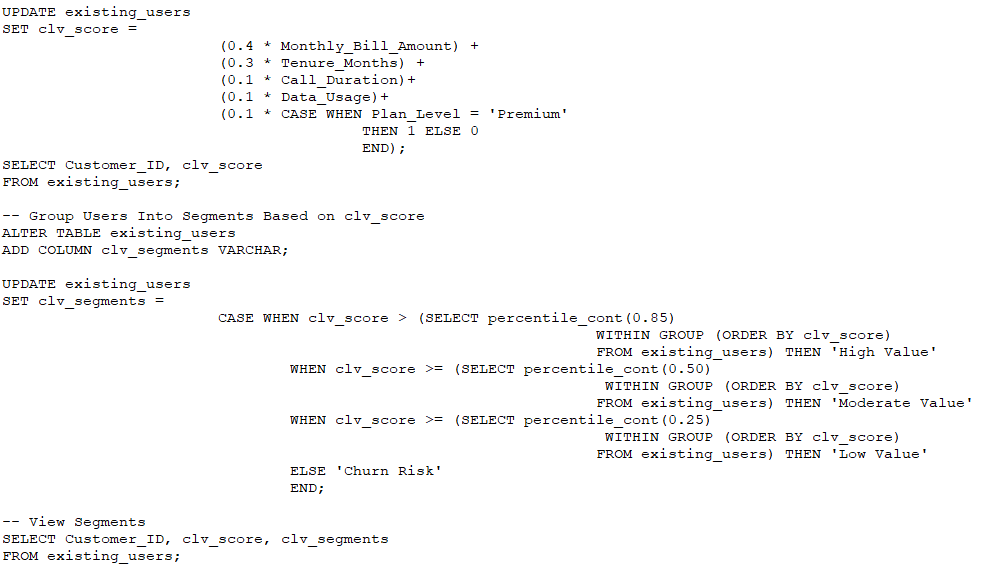

# Telecom-Growth-Strategies-Unlocking-Customer-Lifetime-Value-Through-Smart-Segmentation-
This project involved a deep dive into analyzing customer lifetime value segmentation at NexaSat, utilizing SQL to uncover actionable insights.
This analysis will enable identifying up-selling and cross-selling opportunities within the telecom industry, leveraging data-driven strategies to maximize revenue potential and enhance customer engagement. Utilizing advanced SQL techniques to analyze extensive customer data, contributing significantly to strategic decision-making processes at NexaSat.

 

## Project Learning Opportunities:
Dive deep into a robust analysis of Customer Lifetime Value segmentation at NexaSat using SQL. This project presents a unique chance to uncover actionable insights for up-selling and cross-selling opportunities within the telecom industry. By leveraging data-driven strategies and SQL proficiency, maximizing revenue potential and elevating customer engagement. This project promises invaluable learning in both advanced SQL techniques and strategic decision-making within the telecommunication sector.

## Key learning (Learning Skills)
- SQL Proficiency

## Business: Introduction:
NexaSat, headquartered in the dynamic city of Abuja, is a prominent player in the telecommunication industry.

 
 
## Business Overview/Problem:
NexaSat, while enjoying a strong presence in the telecommunications industry, faces a pressing challenge in optimizing its marketing strategies and resource allocation. The company grapples with a diverse customer base, ranging from occasional users to loyal enthusiasts. This diversity has led to inefficiencies in their customer engagement efforts, as a one-size-fits-all approach proves ineffective. Moreover, as competition in the telecom sector intensified, NexaSat realized the imperative to maximize revenue from their existing customer base, while also identifying and nurturing high-potential prospects. This required a nuanced understanding of their customers' lifetime value.
The company has also identified an untapped potential within its existing customer base, recognizing that personalized offers and bundled services could significantly increase average revenue per user (ARPU). However, the challenge lies in identifying which customers are most receptive to these opportunities, as well as crafting offers that align with their preferences and usage patterns.
The specific hurdle NexaSat faces is the lack of a structured approach to distinguish high-opportunity segments from the wider customer base. Without this clarity, their up-selling and cross-selling efforts are dispersed, resulting in suboptimal returns. 
Additionally, while NexaSat possesses a wealth of customer data, it lacks a systematic methodology to harness these insights effectively. This leads to missed opportunities and hinders their ability to maximize revenue potential. As a result, a comprehensive solution is imperative to categorize customers based on their propensity for additional services and to tailor offerings that would resonate with their unique needs.

 

## Rationale for the Project (Why CLV Segmentation):
Customer Lifetime Value (CLV) segmentation is a data-driven strategy that involves categorizing customers into distinct groups based on their potential long-term value to a company. It allows businesses to identify and prioritize high-value customer segments, thereby enabling targeted marketing efforts and tailored service offerings. By understanding the unique needs and behaviors of each segment, companies can optimize resource allocation, maximize revenue, and foster stronger customer relationships.
For NexaSat, the adoption of CLV segmentation directly addresses their primary challenge: unlocking up-selling and cross-selling opportunities within their customer base. 
By categorizing customers based on their likelihood to engage with additional services, NexaSat can design personalized offers and bundled packages that resonate with each segment. This approach ensures that resources are allocated efficiently, focusing on high-opportunity segments that promise the greatest return on investment. Ultimately, CLV segmentation empowers NexaSat to not only boost revenue streams but also strengthen customer loyalty in an increasingly competitive telecom landscape.
 
## Aim of the Project:
The primary aim of implementing Customer Lifetime Value (CLV) segmentation at NexaSat is to drive strategic revenue growth through targeted up-selling and cross-selling initiatives. By leveraging CLV segmentation, NexaSat aims to identify high-opportunity customer segments, customize service offerings, and optimize marketing strategies. This approach will not only maximize the average revenue per user (ARPU) but also enhance customer satisfaction and loyalty.
Ultimately, NexaSat seeks to secure a competitive edge in the telecommunications industry by delivering tailored solutions that align with the unique needs and preferences of its customers, thereby ensuring long-term profitability and sustainable business growth.

Working with NexaSat customer data from July 2023 as an attempt to solve the business problem.

## Data Description:
- **Customer_ID:** Unique identifier for each customer.

- **Gender:** Gender of the customer.

- **Partner:** Indicates if the customer has a partner (Yes/No).

- **Dependents:** Indicates if the customer has dependents (Yes/No).

- **Senior_Citizen:** Indicates if the customer is a senior citizen (1 for yes, 0 for no).

- **Call_Duration:** Total duration of calls made by the customer.

- **Data_Usage:** Amount of data used by the customer.

- **Plan_Type:** Type of plan subscribed by the customer (Prepaid/Postpaid).

- **Plan_Level:** Level or tier of the subscribed plan (Basic/Premium).
  
  :                                  
 
## Tech Stack:
PostgreSQL is used for data manipulation and analysis.

## Project Scope:
- Exploratory Data Analysis: Conduct a thorough examination of the customer dataset, including demographic information and usage patterns. This will provide crucial insights into customer behavior and preferences.
- Feature Engineering: Engineer relevant features such as CLV and CLV Scores. These will serve as key inputs for the CLV segmentation model.
- Segmentation: Assign customers to different segments based on their CLV scores. Further segment users based on demographic data, usage patterns, and service plans.
- Segment Profiling and Strategy Formulation: Understand the unique traits that define each segment and decide the kind of attention each segment requires. Develop personalized marketing and communication strategies for each segment. 
  - This may include special offers, targeted promotions, or exclusive services that resonate with the preferences and behaviors of each group.

## Data Cleaning:

## Exploratory Data Analysis

- Customer Lifetime Value (CLV) Segmentation

- Up-Selling and Cross-Selling

- Analysis and Interpretation

## ANALYSIS AND INSIGHTS:

### CLV SEGMENTATION:

## RECOMMENDATION AND CONCLUSIONS:

:   

